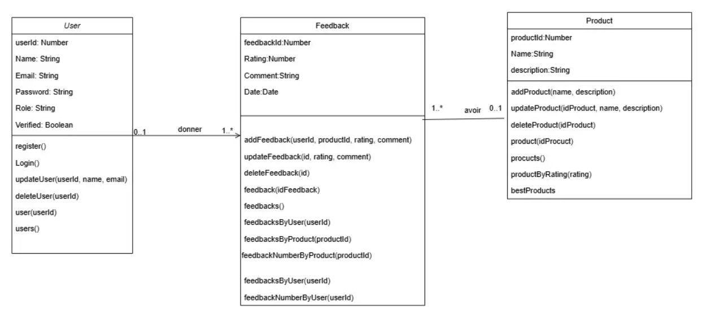

# 🚀 Feedback Management System API


📌**Problématique:**

Une entreprise SaaS souhaite recueillir les avis de ses utilisateurs sur ses produits numériques. Actuellement, aucun système structuré ne permet de collecter, sécuriser et exploiter ces retours de manière automatisée. Cela limite l'amélioration continue, la satisfaction client et l’analyse des performances produits.

---
✅ **Solution proposée:**

Mise en place d’un système de feedback basé sur une API GraphQL. Cette solution permet une récupération ciblée, fluide et optimisée des données (utilisateurs, produits, avis), avec une gestion des rôles (admin/user), une authentification sécurisée, et un accès structuré aux informations pertinentes.


## ✨ Features
### 🔐 Authentication
- User registration with email verification
- JWT token authentication
- Password reset functionality
- Role-based authorization (Admin/User)

### 📦 Products
- Create, read, update,  delete products,get products by id ,get all products
- Automatic average rating calculation
- Filter products by rating
- Get top-rated products

### 💬 Feedback
- Submit and manage product feedback (1-5 star ratings)
- View feedback by user or product
- feedback Number by user or product
- Real-time rating updates


## 🛠️ Technical Stack
- *Backend*: Node.js with Apollo Server
- *Database*: MongoDB with Mongoose
- *Authentication*: JWT with bcrypt password hashing
- *Email Services*: Nodemailer with Gmail SMTP

## 📚 API Documentation

### 📌 Authentication Flow

1. *Register*: Creates user and sends verification email
2. *Verify Email*: User verifies with token from email
3. *Login*: Gets JWT token for authenticated requests
4. *Password Reset*: Request email → Reset with token

## 🚀 Getting Started

### 1. Clone the Repository

```bash
git clone https://github.com/AhlemBenmed/FeedbackGraphQL.git
cd FeedbackGraphQL
````

### 2. Install Dependencies

```bash
npm install
```

### 3. Set Up MongoDB

* Make sure MongoDB is running locally or use a cloud provider (e.g. MongoDB Atlas).
* Update your connection string in `db.js` or `.env` file.

### 4. Start the Server

```bash
npm start
```

The GraphQL playground will be available at:
`http://localhost:4000/`

---
## 📊  Diagramme de classes

---
## 🔍 GraphQL Schema Overview

### Types

```graphql
type User {
  id: ID!
  name: String!
  email: String!
  role: String! (admin/user)
  verified: Boolean!
  feedbacks: [Feedback]
}

type Product {
  id: ID!
  name: String!
  description: String
  feedbacks: [Feedback]
  averageRating: Float
}
type Feedback {
  id: ID!
  user: User!
  product: Product!
  rating: Int! (1-5)
  comment: String
  date: String
}

```


## 🚦 Usage Examples

### 🔐 Authentication
*Register User:*
```graphql
mutation {
  register(
    name: "John Doe"
    email: "john@example.com"
    password: "secure123"
    role: "user"
  ) {
    token
    user { id name email }
  }
}
```
*Verify Email:*
```graphql
mutation {
  verifyEmail(token: "EMAIL_VERIFICATION_TOKEN")
}
```
*Login:*
```graphql
mutation {
  login(email: "john@example.com", password: "secure123") {
    token
    user { id name email }
  }
}
```
### 📦 Product Operations

*Add Product (Admin Only):*
```graphql
mutation {
  addProduct(name: "Premium Widget", description: "High quality widget") {
    id name description
  }
}
```
*Get Top Products:*

```graphql
query {
  bestProducts {
    id
    name
    averageRating
  }
}
```
### 💬 Feedback Operations

*Add Feedback:*

```graphql
mutation {
  addFeedback(
    productId: "PRODUCT_ID"
    rating: 5
    comment: "Excellent product!"
  ) {
    id
    rating
    product { name averageRating }
  }
}
```
*Get Product Feedback:*
```graphql
query {
  product(id: "PRODUCT_ID") {
    name
    averageRating
    feedbacks {
      rating
      comment
      user { name }
    }
  }
}
```

## ⚙️ Configuration
Create .env file with:
```env
JWT_SECRET=your_secret_key
MONGO_URI=mongodb://localhost:27017/feedbackdb
EMAIL_USER=your_email@gmail.com
EMAIL_PASS=your_email_password
```

## 📧 Email Templates

*Verification Email:*
```html
<div style="font-family: Arial; max-width: 500px; margin: auto; border: 1px solid #eee; padding: 24px; border-radius: 8px;">
  <h2 style="color: #4CAF50;">Welcome to Feedback App!</h2>
  <p>Verify your email with this token:</p>
  <pre style="background: #4CAF50; color: #fff; padding: 12px 24px; border-radius: 4px; font-size: 2em;">TOKEN</pre>
</div>
```
*Password Reset Email:*
```html

<div style="font-family: Arial; max-width: 500px; margin: auto; border: 1px solid #eee; padding: 24px; border-radius: 8px;">
  <h2 style="color: #2196F3;">Password Reset Request</h2>
  <p>Use this token to reset your password:</p>
  <pre style="background: #2196F3; color: #fff; padding: 12px 24px; border-radius: 4px; font-size: 2em;">TOKEN</pre>
</div>
```
## 🏗️ Project Structure
```
src/
├── models.js
├── auth.js
├── db.js
├── schema.js
└── index.js
```

## 🔒 Security

- Password hashing with bcrypt
- JWT token expiration (1 day)
- Email verification required
- Password reset token expiration (1 hour)
- Role-based authorization checks


## 🧪 Testing

You can test the API using:

* [Thunder Client](https://www.thunderclient.com/) (VS Code Extension)
* Postman (with GraphQL support)
* Apollo Studio Playground
* Access GraphQL Playground at `http://localhost:4000`
---

## 🧑‍💻 Author

Made with ❤️ by Ahlem And Nour
